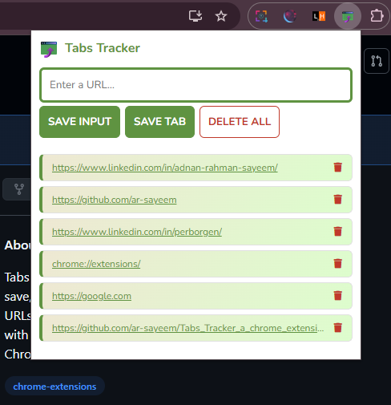

# 🔗 Tabs Tracker — Chrome Extension

A lightweight Chrome Extension to save, manage, and revisit important URLs directly from your browser. No more losing track of important tabs!

---

## ✨ Features

- 💾 Save any URL manually by typing it in
- 🌐 Save your current tab's URL in one click
- 🗑️ Delete individual saved links
- 🔄 Data persists across browser restarts using `localStorage`
- 🎨 Clean, minimal UI with a green theme

---

## 📸 Preview

<div align="center">



</div>

---

## 🚀 How to Install in Your Chrome Browser

Since this extension is not on the Chrome Web Store, you can load it manually in **Developer Mode**. Here's how:

### Step 1 — Download the project

Clone the repository or download it as a ZIP file:

```bash
git clone https://github.com/ar-sayeem/Tabs_Tracker_a_chrome_extension.git
```

Or click **Code → Download ZIP** on GitHub and extract it.

---

### Step 2 — Open Chrome Extensions page

Open a new tab and go to:

```
chrome://extensions
```

---

### Step 3 — Enable Developer Mode

In the top-right corner of the Extensions page, toggle **Developer Mode** ON.

---

### Step 4 — Load the extension

Click **"Load unpacked"** and select the folder where you downloaded/cloned the project.

---

### Step 5 — Pin the extension *(optional but recommended)*

Click the puzzle piece icon 🧩 in the Chrome toolbar, find **Tabs Tracker**, and click the pin icon 📌 to keep it visible in your toolbar.

---

## 🛠️ How to Use

| Action | How |
|---|---|
| Save a URL manually | Type a URL in the input field and click **SAVE INPUT** |
| Save current tab | Click **SAVE TAB** to save the URL of the tab you're on |
| Open a saved link | Click any link in the list — it opens in a new tab |
| Delete a single link | Click the 🗑️ icon next to any saved link |
| Delete all links | **Double-click** the **DELETE ALL** button |

> 💡 You can type just `example.com` — the extension will automatically add `https://` for you.

---

## 🧠 How It Works

### Chrome Tabs API
The **SAVE TAB** button uses the Chrome Tabs API to detect which tab you are currently on and grab its URL automatically — no copy-pasting needed.

```javascript
chrome.tabs.query({ active: true, currentWindow: true }, function (tabs) {
  myLeads.push(tabs[0].url);
});
```

### localStorage
All your saved links are stored in the browser's `localStorage`. This means your links **survive browser restarts** — no backend or database required.

```javascript
localStorage.setItem("myLeads", JSON.stringify(myLeads));
```

---

## 🗂️ Project Structure

```
Tabs_Tracker_a_chrome_extension/
├── index.html          # Popup UI
├── styles.css          # Styling
├── index.js            # Extension logic
├── manifest.json       # Chrome Extension config
├── icon.png            # Extension icon
├── extension_ss.png    # Preview screenshot
├── LICENSE             # MIT License
└── README.md           # Documentation
```

---

## 🔧 Built With

- HTML
- CSS
- JavaScript
- Chrome Extensions API (Manifest V3)

---

## 📄 License

This project is licensed under the [MIT License](https://github.com/ar-sayeem/Tabs_Tracker_a_chrome_extension/blob/main/LICENSE).

---

> Made with 💚 by [ar-sayeem](https://github.com/ar-sayeem)